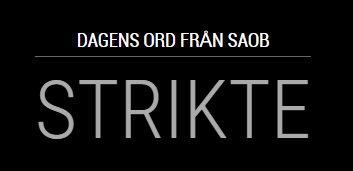

# MMM-SAOB
Today's word from SAOB displayed on your Magic Mirror

Module for https://github.com/MichMich/MagicMirror

# Module: Today's word from SAOB
The `SAOB` module displays today's word from saob.se

## Screenshot


## Using the module

To use this module, add it to the modules array in the `config/config.js` file:
````javascript
modules: [
	{
		module: 'MMM-SAOB'
		position: 'bottom_center' // This can be any of the regions.
		config: {
			title: 'Title',
		}
	}
]
````

## Configuration options

The following properties can be configured:

|Option|                  Description                  |                  Possible values                         | Default |
|------|-----------------------------------------------|----------------------------------------------------------|---------|
|`title`| Title shown above the today's word.| Text | Dagens ord från SAOB |
